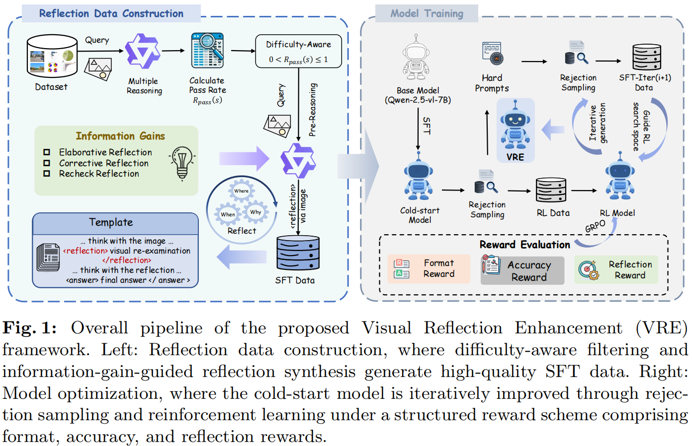
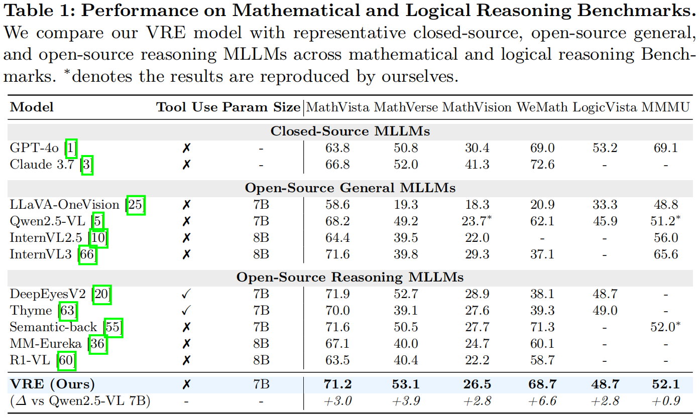
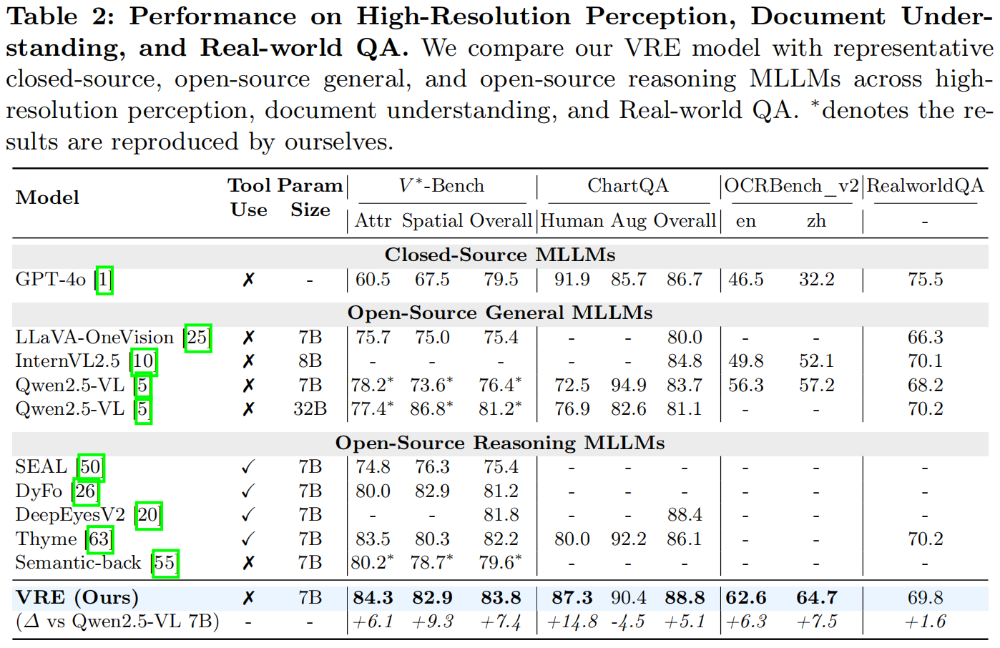

# Reflect to Inform: Boosting Multimodal Reasoning via Information-Gain-Driven Verification

[](https://github.com/your-username/VRE)
[](https://huggingface.co/datasets)
[](https://huggingface.co/models)

This repository contains the official implementation of the paper: **"Reflect to Inform: Boosting Multimodal Reasoning via Information-Gain-Driven Verification"**.
The key component of this project is **VRE (Visual Re-Examination)**, a self-evolving training framework that mitigates **Visual Drift** in Multimodal Large Language Models (MLLMs).

---

## 🛠️ Methodology and Architecture

Multimodal Large Language Models (MLLMs) often suffer from **Visual Drift**: as outputs grow longer, models progressively neglect image evidence and fall back on textual priors, leading to hallucinations. 
**VRE (Visual Re-Examination)** is a self-evolving training framework that enables MLLMs to autonomously perform visual introspection during reasoning. 
Unlike traditional methods that require high-resolution patches or external tools, VRE elicits the model's latent capability to **re-examine** at original image tokens to extract missing evidence.


The main VRE pipeline is illustrated below:

<p align="center">
  
</p>


---

## 🔥 Key Contributions

Multimodal models often suffer from **Visual Drift**: as outputs grow longer, models progressively neglect image evidence and fall back on textual priors, leading to hallucinations. VRE addresses this by enabling models to autonomously perform visual introspection.

* **Identification of Visual Drift**: Characterizing the progressive modality disconnect in long-form generation.
* **Information-Gain-Driven Synthesis**: A data engine that filters noisy traces and ensures reflections provide genuine visual grounding.
* **Homologous Reconstruction**: Using the same visual backbone to ensure strict perception-reasoning alignment.
* **High Performance**: Extensive experiments demonstrate that VRE delivers consistent, iterative gains on diverse multimodal benchmarks, significantly enhancing long-chain visual reasoning while mitigating hallucinations.

---

## 🚀 Performance

VRE has demonstrated outstanding performance improvements in multiple evaluations.

* **Mathematical and Logical Reasoning**: VRE achieves exceptional capabilities in deep logical tracking and mathematical deduction, securing significant absolute gains over the base model on rigorous benchmarks like MathVista, MathVerse, and WeMath.

<p align="center">
  
</p>

* **High-Resolution Perception and Document Understanding**: VRE excels in fine-grained visual grounding and complex data extraction, completely outperforming tool-augmented reasoning models on V*-Bench and delivering substantial enhancements on ChartQA and OCRBench_v2.
<p align="center">
  
</p>

---

## 💻 Usage

### Installation

```bash
git clone [https://github.com/your-username/VRE.git](https://github.com/your-username/VRE.git)
```

Note: Code and weights will be available soon.
